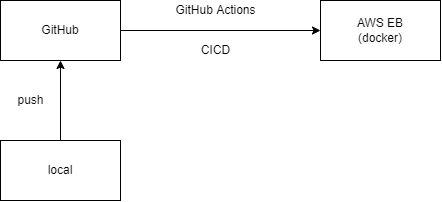

# docker-react

An easy project that I practice using Docker, CICD (GitHub Actions) and publish to AWS Elasticbeanstalk.

## Workflow

## What I learn

- use WSL2 to develop (so much pain)

- lots of command about docker, docker-compose

- use `volume` to develop between local and container

- write Dockerfile with `multi layers`

- GitHub Action to trigger CICD pipeline

- a little AWS IAM setting
